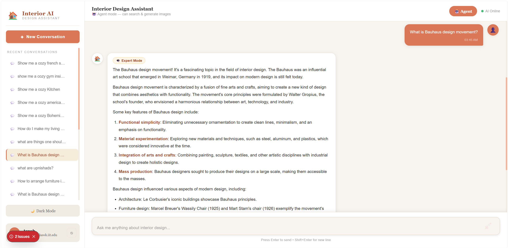
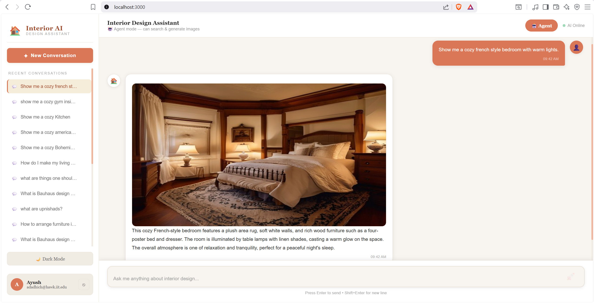
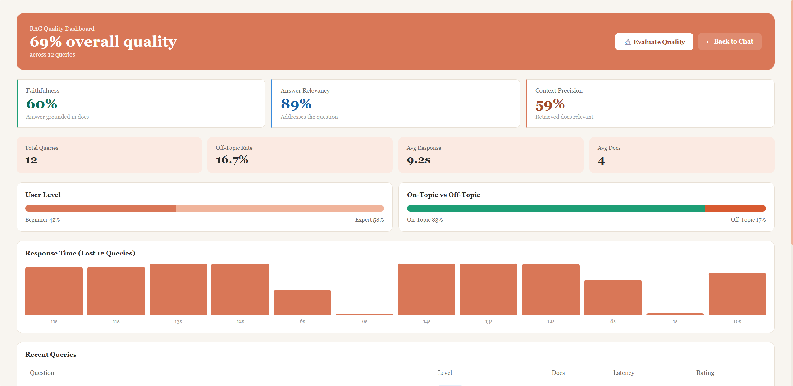
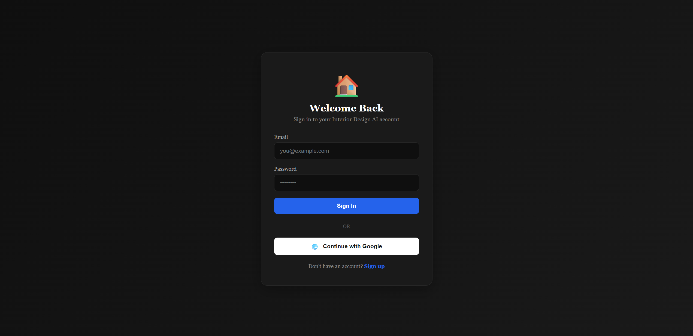

# 🏠 Interior Design RAG Assistant

An AI-powered interior design assistant built on a **Retrieval-Augmented Generation (RAG)** pipeline with an **agentic** layer that can autonomously search a design knowledge base and generate visual renders on demand. Serves both design beginners and professionals, with multi-user authentication, swappable databases, and a built-in evaluation dashboard.

> Built end-to-end as a full-stack project: **FastAPI + LangGraph + Ollama** on the backend, **Next.js + TypeScript** on the frontend, running entirely on free/local infrastructure.

---

## 📸 Screenshots

> _Add your screenshots to a `screenshots/` folder in the repo root and they'll render here._

**Chat Interface (Light & Dark themes)**


**Agent Mode — AI-Generated Interior Render**


**RAG Quality Dashboard**


**Authentication**


---

## ✨ Features

### Core RAG
- **LangGraph pipeline** with topic-guarding, user-level classification, retrieval, document grading, generation, and hallucination checks
- **Streaming responses** (word-by-word, server-sent events) for a ChatGPT-like feel
- **Conversation memory** — context carried across turns
- **Beginner / Expert detection** — answers adapt to the user's apparent expertise
- **Topic guard** — politely declines off-topic questions

### Agentic AI
- **Tool-calling agent** (LangGraph ReAct) that autonomously decides which tools to use
- **Knowledge search tool** — semantic retrieval over the design corpus
- **Image generation tool** — produces interior renders from natural-language descriptions
- **Dual mode** — switch between the classic deterministic pipeline and the agent at runtime

### Platform
- **Multi-user authentication** via Firebase (email/password + Google OAuth, with email verification)
- **User-isolated data** — every user sees only their own conversations
- **Pluggable databases** via the factory pattern:
  - Chat store: **MongoDB ↔ Firestore**
  - Vector store: **ChromaDB ↔ Pinecone**
  - Switch with a single environment variable — no code changes
- **Evaluation dashboard** — live metrics plus LLM-as-judge quality scoring (faithfulness, answer relevancy, context precision)
- **Light / dark theme** with a warm, design-appropriate accent

---

## 🛠️ Tech Stack

| Layer | Technology |
|---|---|
| **Frontend** | Next.js 16, TypeScript, Tailwind CSS |
| **Backend** | FastAPI (Python), async streaming |
| **Orchestration** | LangGraph (pipeline + ReAct agent) |
| **LLM** | Ollama — `llama3.1:8b` (local, GPU-accelerated) |
| **Embeddings** | `sentence-transformers` (`all-MiniLM-L6-v2`, 384-dim) |
| **Vector DB** | ChromaDB (local) / Pinecone (cloud) |
| **Chat DB** | MongoDB (local) / Firestore (cloud) |
| **Auth** | Firebase Authentication |
| **Image Gen** | Pollinations (text-to-image) |

---

## 🏗️ Architecture

```
┌─────────────────────────────────────────────────────────────┐
│                      Next.js Frontend                         │
│   Chat UI · Agent toggle · Auth pages · Quality dashboard     │
└───────────────────────────┬─────────────────────────────────┘
                            │  HTTPS (Firebase ID token)
┌───────────────────────────▼─────────────────────────────────┐
│                       FastAPI Backend                         │
│                                                               │
│   ┌────────────────────┐         ┌────────────────────────┐  │
│   │  Classic Pipeline  │         │      Agentic Layer      │  │
│   │  (LangGraph graph) │         │  (LangGraph ReAct agent)│  │
│   │  triage→retrieve→  │         │  decides: search /      │  │
│   │  grade→generate    │         │  generate image / chat  │  │
│   └─────────┬──────────┘         └───────────┬────────────┘  │
│             │                                │               │
│             └──────────────┬─────────────────┘               │
│                            │                                 │
│        ┌───────────────────┼───────────────────┐            │
│        ▼                   ▼                   ▼             │
│   ┌─────────┐         ┌─────────┐         ┌──────────┐       │
│   │ Vector  │         │  Chat   │         │  Ollama  │       │
│   │   DB    │         │   DB    │         │ (LLM)    │       │
│   │ Chroma/ │         │ Mongo/  │         │ llama3.1 │       │
│   │ Pinecone│         │ Firestore│        │          │       │
│   └─────────┘         └─────────┘         └──────────┘       │
└───────────────────────────────────────────────────────────────┘
```

### How a request flows
1. The user sends a message (authenticated with a Firebase ID token).
2. **Classic mode** runs a fixed LangGraph pipeline: a single triage call (topic guard + user-level classification), document retrieval, generation, and metric logging.
3. **Agent mode** hands the message to a ReAct agent that *decides* whether to search the knowledge base, generate an image, or simply reply — then composes the answer.
4. Responses stream back token-by-token; generated images render inline.
5. Per-query metrics are logged for the dashboard.

### Why these design choices
- **Factory pattern for databases** keeps the app vendor-agnostic and made cloud deployment a config change rather than a rewrite.
- **Dual mode (pipeline + agent)** preserves a reliable deterministic path while showcasing autonomous tool use.
- **Local-first stack** (Ollama, ChromaDB) keeps development free and private; cloud equivalents (Pinecone, Firestore) are drop-in for deployment.

---

## 📊 Evaluation

The app logs per-query metrics and supports **LLM-as-judge** evaluation inspired by RAGAS:

- **Faithfulness** — is the answer grounded in the retrieved context?
- **Answer Relevancy** — does the answer address the question?
- **Context Precision** — were the retrieved documents actually relevant?

Scores are computed by a local LLM judge (temperature 0) and surfaced on the dashboard alongside latency, retrieval counts, off-topic rate, and user-level distribution.

---

## 🚀 Local Setup

### Prerequisites
- **Python 3.10+** (3.12 recommended)
- **Node.js 18+** and npm
- **Ollama** installed with the `llama3.1:8b` model pulled
- **MongoDB** (if using the default local chat store)
- A **Firebase** project (for authentication)
- *(Optional)* **Pinecone** account if using the cloud vector store

### 1. Clone the repository
```bash
git clone https://github.com/<your-username>/interior-design-rag.git
cd interior-design-rag
```

### 2. Backend setup
```bash
cd backend
python -m venv venv

# Windows
venv\Scripts\activate
# macOS / Linux
source venv/bin/activate

pip install -r requirements.txt
```

Create a `.env` file in `backend/`:
```env
# LLM
OLLAMA_BASE_URL=http://127.0.0.1:11434
OLLAMA_MODEL=llama3.1:8b

# Embeddings
EMBEDDING_MODEL=all-MiniLM-L6-v2
DEVICE=cuda            # or "cpu"

# Vector DB  (chromadb | pinecone)
VECTOR_DB_TYPE=chromadb
CHROMA_DB_PATH=./vectorstore/chromadb
CHROMA_COLLECTION_NAME=interior_design
# PINECONE_API_KEY=...
# PINECONE_INDEX_NAME=interior-design-rag
# PINECONE_CLOUD=aws
# PINECONE_REGION=us-east-1

# Chat DB  (mongodb | firestore)
DATABASE_TYPE=mongodb
MONGODB_URL=mongodb://127.0.0.1:27017
MONGODB_DB_NAME=interior_design_rag
# FIRESTORE_COLLECTION_NAME=chats

# Firebase
FIREBASE_CREDENTIALS_PATH=./firebase-credentials.json

# API
API_HOST=0.0.0.0
API_PORT=8000
FRONTEND_URL=http://localhost:3000
```

Add your Firebase Admin service-account file as `backend/firebase-credentials.json` (this file is gitignored).

### 3. Ingest the knowledge base
Place your source PDF(s) in `backend/data/raw/`, then:
```bash
python -m src.data_loader
```

### 4. Frontend setup
```bash
cd ../frontend
npm install
```

Create `frontend/.env.local` with your Firebase web config:
```env
NEXT_PUBLIC_FIREBASE_API_KEY=...
NEXT_PUBLIC_FIREBASE_AUTH_DOMAIN=...
NEXT_PUBLIC_FIREBASE_PROJECT_ID=...
NEXT_PUBLIC_FIREBASE_STORAGE_BUCKET=...
NEXT_PUBLIC_FIREBASE_MESSAGING_SENDER_ID=...
NEXT_PUBLIC_FIREBASE_APP_ID=...
```

### 5. Run everything
Open separate terminals:
```bash
# 1. MongoDB (if DATABASE_TYPE=mongodb)
mongod --dbpath <your-data-path>

# 2. Ollama (usually runs as a service; otherwise)
ollama serve

# 3. Backend
cd backend && venv\Scripts\activate && python main.py

# 4. Frontend
cd frontend && npm run dev
```

Visit **http://localhost:3000**, register an account, verify your email, and start designing.

---

## 🗂️ Project Structure

```
.
├── backend/
│   ├── api/                # FastAPI routes (chat, agent, dashboard, auth-protected CRUD)
│   ├── src/
│   │   ├── graph.py        # LangGraph classic pipeline
│   │   ├── agent.py        # LangGraph ReAct agent
│   │   ├── agent_tools.py  # Agent tools (search, image generation)
│   │   ├── evaluator.py    # LLM-as-judge evaluation
│   │   ├── vector_db/      # Vector store abstraction (Chroma/Pinecone)
│   │   └── ...
│   ├── database/           # Chat store abstraction (Mongo/Firestore) + metrics
│   ├── auth/               # Firebase token verification
│   └── main.py
└── frontend/
    ├── app/                # Next.js app router (chat, login, register, dashboard)
    ├── components/         # Chat UI, sidebar, message bubbles, etc.
    └── ...
```

---

## 🧭 Roadmap

- [ ] Cloud deployment (swap local Ollama for a hosted LLM)
- [ ] Additional agent tools (color-palette generator, budget estimator)
- [ ] Image-based room analysis (upload a photo for feedback)
- [ ] Mobile-responsive layout
- [ ] Automated test suite

---

## 📝 Notes

- This project runs on free and local infrastructure by design. The image-generation tool uses a free third-party service whose availability and terms can change.
- It is a learning and portfolio project, not a production service — there is no rate limiting or hardened security layer yet.

---

## 📄 License

Released under the MIT License. See `LICENSE` for details.
